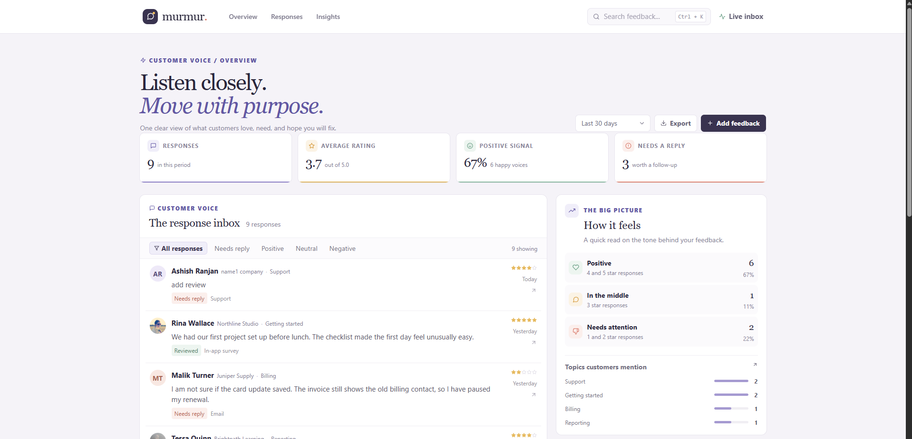

# murmur. - Customer Feedback Dashboard

murmur. brings customer feedback into one calm workspace. Review individual responses, see how sentiment is shifting, and identify the follow-up that needs attention.

**Live dashboard:** [https://a2rp.github.io/customer-feedback-dashboard/](https://a2rp.github.io/customer-feedback-dashboard/)

## Features

- Review an inbox of customer comments, ratings, sources, topics, and follow-up status.
- Search responses and filter by reply status or sentiment.
- Track response volume, average rating, positive sentiment, and replies due.
- Browse a recent response trend and the topics customers mention most.
- Add feedback, open a response, mark it reviewed, or flag it for a reply.
- Export the currently filtered responses as a CSV file.
- Keep new feedback and status changes in browser storage.
- Use the responsive layout on desktop, tablet, and mobile screens.

## Run locally

```sh
npm install
npm run dev
```

## Checks and deployment

```sh
npm run lint
npm run build
npm run deploy
```

`npm run deploy` builds the app and publishes the `dist` folder to the `gh-pages` branch. The live site is hosted at [https://a2rp.github.io/customer-feedback-dashboard/](https://a2rp.github.io/customer-feedback-dashboard/).

## Links

- Portfolio: [https://www.ashishranjan.net](https://www.ashishranjan.net)
- GitHub: [https://github.com/a2rp](https://github.com/a2rp)
- CodePen: [https://codepen.io/ash1198](https://codepen.io/ash1198)
- LinkedIn: [https://www.linkedin.com/in/aashishranjan](https://www.linkedin.com/in/aashishranjan)
- Facebook: [https://www.facebook.com/theash.ashish/](https://www.facebook.com/theash.ashish/)
- YouTube: [https://www.youtube.com/@ashishranjan-ashz?sub_confirmation=1](https://www.youtube.com/@ashishranjan-ashz?sub_confirmation=1)
- Email: [mailto:ash.ranjan09@gmail.com](mailto:ash.ranjan09@gmail.com)

## Support

- Support: [https://a2rp-donation-page.netlify.app/](https://a2rp-donation-page.netlify.app/)
- Buy Me a Coffee: [https://buymeacoffee.com/ashishranjan](https://buymeacoffee.com/ashishranjan)
- Patreon: [https://www.patreon.com/ashishranjan](https://www.patreon.com/ashishranjan)
